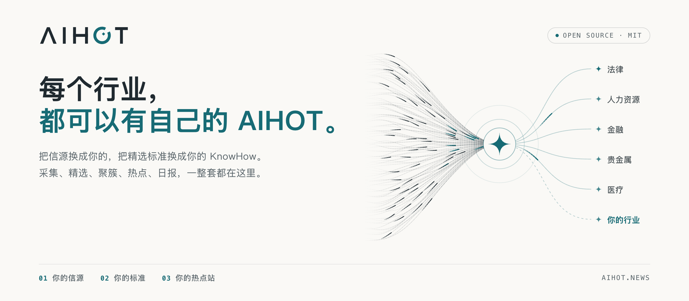

<p align="right">
  <b>English</b> | <a href="README.md">繁體中文</a>
</p>

<p align="center">
  <picture>
    <source media="(prefers-color-scheme: dark)" srcset="docs/assets/banner-dark.png">
    
  </picture>
</p>

<p align="center">
  <a href="LICENSE"></a>
  
  
  
  <a href="https://aihot.news"></a>
</p>

<p align="center">
  <b>A framework that discovers hot topics and writes briefings automatically.</b><br>
  Replace the sources and selection standards to create a news site for your own industry.
</p>

<p align="center">
  <a href="#quick-start">Quick Start</a> ·
  <a href="docs/customize.md">Customize</a> ·
  <a href="#how-it-works">How It Works</a> ·
  <a href="#documentation">Documentation</a> ·
  <a href="FORK.md">Fork Notes</a>
</p>

> **Fork note**: This repository is maintained from [KKKKhazix/AIHOT](https://github.com/KKKKhazix/AIHOT). See [`FORK.md`](FORK.md) for policy, [`docs/DIVERGENCE.md`](docs/DIVERGENCE.md) for file-level differences, and [`docs/UPSTREAM.md`](docs/UPSTREAM.md) for upstream review records.

## What This Is

[AIHOT](https://aihot.news) is an automated news aggregation and briefing system. It collects material from multiple sources, pre-filters it with a large language model, scores candidates twice, and writes Chinese headlines, summaries, and recommendation notes. Reports covering the same story are clustered into events and ranked using independent-source counts with time decay.

The repository contains the website, admin panel, selection pipeline, event grouping, hotness calculation, and all prompts and thresholds.

## How It Works

```text
Sources → deduplication/pre-filter → dual scoring and writing → event grouping → hotness
                                                                └→ daily → weekly/monthly
```

- **Event grouping**: Candidate events are found from titles and summaries over the previous two weeks. Embeddings are used when configured; otherwise text overlap is used. An LLM then decides whether an item is the same event, a follow-up, or a separate story.
- **Hotness**: Each independent source counts once within 48 hours, with a 24-hour half-life. Repeated posts from one outlet do not inflate the score.
- **Selection and reports**: One selected item represents each news fact. Daily reports are compiled deterministically without model calls. Weekly and monthly reports are assembled from dailies; the model writes only overviews and section introductions.

## Features

| Feature | Description |
|---|---|
| Multiple source types | RSS, web lists, JSON APIs, X, WeChat official accounts, and external ingestion; source tiers and adaptive polling |
| Dual selection | Pre-filtering, two independent scores, tier thresholds, and same-news deduplication; calibrated with SelectBench |
| Writing | Chinese headlines, conclusion-first summaries, recommendation notes, translation, classification, tags, and fact extraction |
| Events and hotness | Cross-source grouping, event digests, timeline ordering, independent-source heat, and trend indicators |
| Daily/weekly/monthly | Daily at 08:00, weekly on Monday, monthly on the first day of each month |
| Topics and search | Company, direction, and content-format pages; 12-month chronicles; title, summary, and full-text search |
| Agent interfaces | RSS, public API, MCP, Agent Markdown, `llms.txt`, and OpenAPI 3.0.0 |
| Admin panel | Source management and test crawls, diagnostics, evaluation, model routing, budget circuit breaker, runs, and alerts |

## Quick Start

You need [Docker](https://docs.docker.com/get-docker/) and an OpenAI-compatible model API key, such as DeepSeek, Qwen, or GLM. Local development also requires Node.js 24+.

```bash
git clone https://github.com/SanHsien/AIHOT.git myhot
cd myhot
node scripts/init-env.ts --llm-key <YOUR_MODEL_API_KEY>
docker compose up -d --build
```

Open <http://localhost:3000>. The admin panel is at `/admin`; its password is `ADMIN_PASSWORD` in `.env`. Collection normally starts within a few minutes, and initial ingestion takes about 30 minutes.

## Customize for Your Industry

Industry-specific settings live under [`industry/`](industry/):

| File | Purpose |
|---|---|
| `site.ts` | Site name, subject, homepage, and About copy |
| `taxonomy.ts`, `topics.json` | Categories, tags, and topics |
| `chronicle.ts`, `chronicles/` | Topic chronicle rules and optional curated company history |
| `sources.json` | Initial sources |
| `prompts/` | Selection and writing standards |
| `selection.ts` | Selection thresholds |
| `features.ts` | Feature switches such as leaderboard and Codex reset monitor |
| `brand/`, `pages/` | Icons, terms, and privacy notice |

Spend the most time on `prompts/selection-score.md` and the thresholds. Label 100–200 examples, then calibrate with `scripts/eval-selection.ts` as described in [`docs/selection.md`](docs/selection.md).

## Local Development and Verification

```bash
npm install
bash tools/dev_check.sh
```

With a PostgreSQL test database, run the complete integration suite:

```bash
DATABASE_URL=postgres://127.0.0.1:5432/aihot_test npm test
```

## Documentation

- [Industry customization](docs/customize.md): identity, taxonomy, topics, chronicles, sources, prompts, thresholds, and branding.
- [Sources](docs/sources.md): source types, tiers, full text, and external ingestion.
- [Selection and calibration](docs/selection.md): selection, reporting, and sample-based calibration.
- [Event grouping](docs/grouping.md): event relationships and pairwise gold-set evaluation.
- [Deployment](docs/deploy.md): Docker, domains, HTTPS, upgrades, backups, and cost.
- [Architecture](docs/architecture.md): services, data flow, and public interfaces.
- [Fork maintenance](FORK.md): maintenance policy and boundaries.
- [Upstream review](docs/UPSTREAM.md): reviewed commits, PRs, issues, branches, tags, and releases.

## License and Trademark

Code is licensed under the [MIT License](LICENSE). **The AIHOT name and logo are not included in the MIT license**; use your own brand when deploying. Third-party fonts and marks belong to their respective owners; see [NOTICE](NOTICE) and [NOTICE.md](NOTICE.md).
